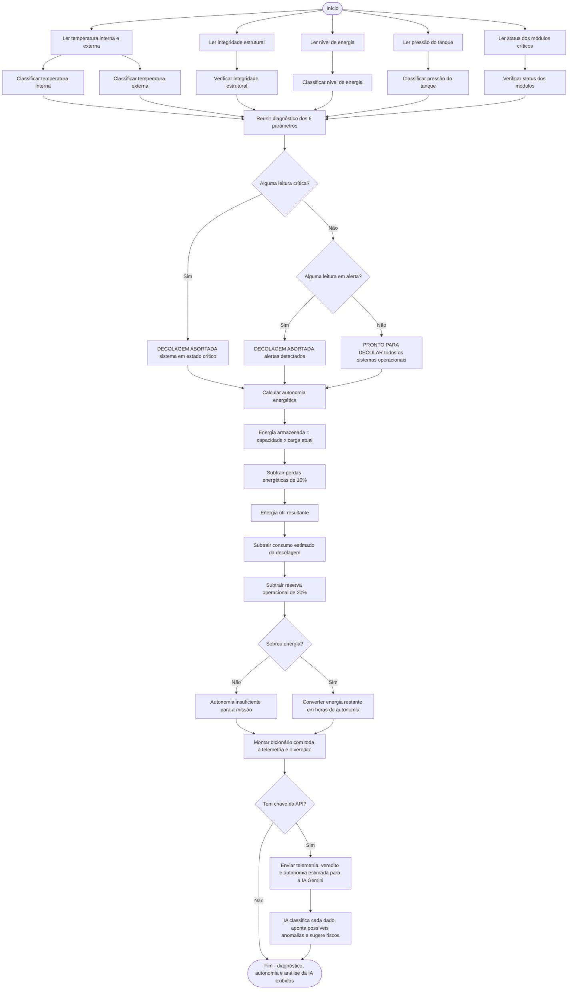
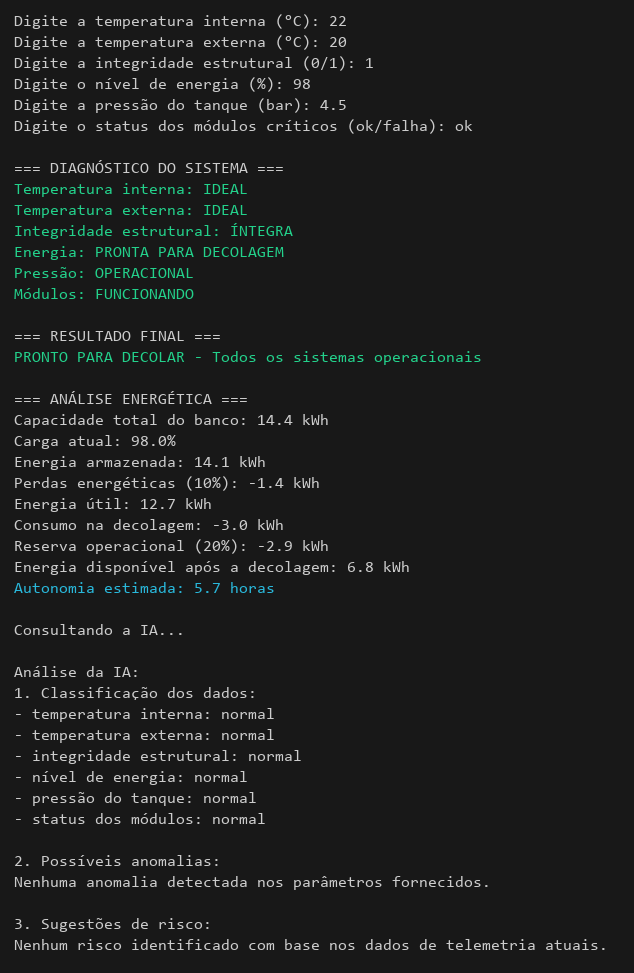
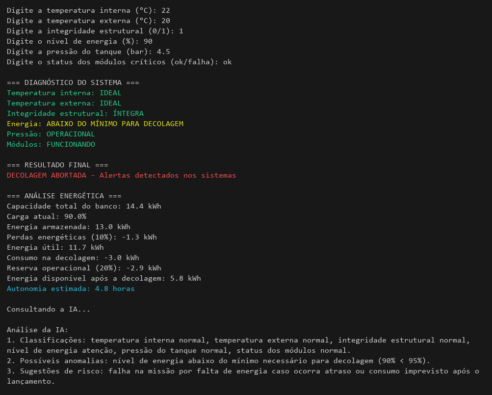
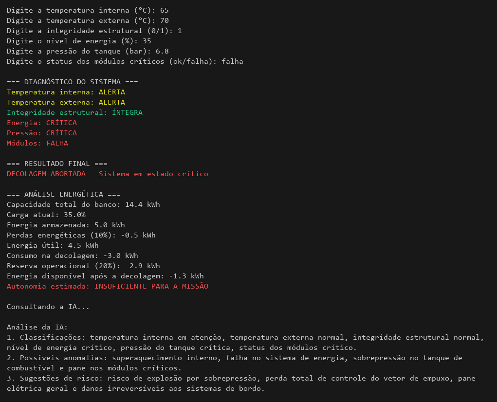

# FIAP - Atividade Integradora (Fase 1)

Verificação pré-decolagem da missão Aurora em Python. O programa lê a telemetria da nave, decide entre **PRONTO PARA DECOLAR** e **DECOLAGEM ABORTADA**, calcula a autonomia da bateria e pede uma análise para a IA do Gemini.

## Integrantes

- **Murilo Ribeiro Falconeri**
- **Gabriel Ferreira da Silva**
- **Gustavo Rocha Caxias**
- **José Kauan Medeiros Machado**

## Arquivos

- `fase1/index.py`: script principal
- `fase1/analise_ia.py`: análise com a IA
- `fase1/relatorio_pre_decolagem.ipynb`: notebook
- `Relatorio Missao Aurora.pdf`: relatório

## Como rodar

```bash
python3 -m venv .venv
source .venv/bin/activate
pip install -r requirements.txt
python fase1/index.py
```

Para a análise por IA, crie um arquivo `.env` na raiz com `GEMINI_API_KEY=sua_chave` (a chave é grátis em [aistudio.google.com/apikey](https://aistudio.google.com/apikey)). Sem ele o programa roda normal e só pula essa parte.

O notebook pode ser aberto no [Google Colab](https://colab.research.google.com/github/Murilo1501/FIAP-atividade-integradora-fase-1/blob/main/fase1/relatorio_pre_decolagem.ipynb). É só executar todas as células. Para a IA, cadastre a chave em Secrets com o nome `GEMINI_API_KEY`.

## Fluxograma



## Prints

Decolagem autorizada:



Energia abaixo do mínimo para decolar:



Várias falhas ao mesmo tempo:



Os outros cenários estão na pasta [prints](prints/).
